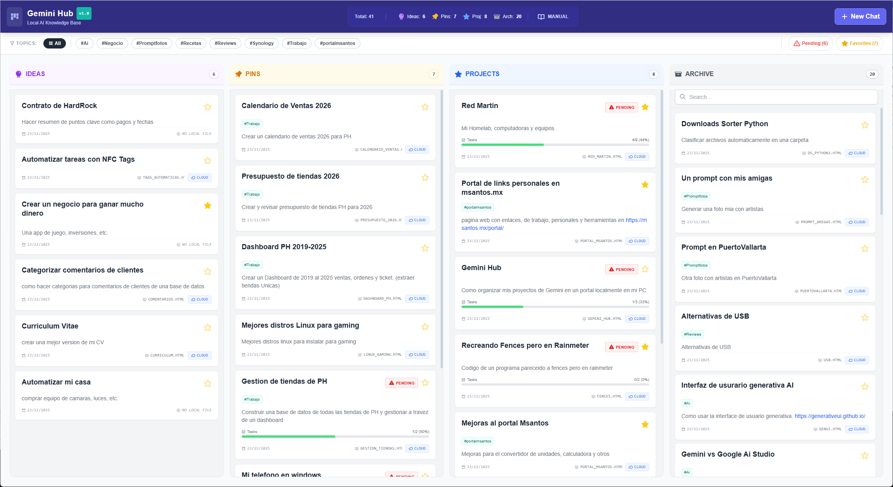

🧠 Gemini Knowledge Hub

Your AI Second Brain. A single-file, local-first Kanban board to organize your Gemini chats, prompts, and projects.

🚀 Why I built this?

I use Google Gemini daily, but I kept losing track of my best conversations. I had brilliant prompts and complex project discussions buried under a pile of "Untitled Chats" in my history.

I tried Notion, Obsidian, and Trello, but they felt too heavy for simply saving chat links. I needed something fast, private, and visual.

So, I built Gemini Knowledge Hub.

✨ Features </b>

📂 Zero Installation: It's just ONE HTML file. No servers, no databases, no command line. Just download and double-click.

🔒 Local-First Privacy: All your data lives in your browser's localStorage. Nothing is sent to the cloud.

⚡ Hybrid Workflow: Each card links to the Live Cloud Chat (to continue working) AND a Local HTML Backup (to preserve the format forever).

🚦 Task Tracking: Add checklists to your cards. If you have unfinished tasks, an auto-tag ⚠️ PENDING appears to keep you focused.

🏷️ Smart Tagging: Organize by topic (#python, #marketing). Includes auto-complete based on your history!

⭐ Favorites: Pin your "Gold Mine" chats with a single click.

📊 Live Stats: See a breakdown of your ideas, pins, and archived projects at a glance.

🛠️ How to Use

Download the index.html file from this repository.

Create a folder on your computer (e.g., My Gemini Brain).

Place index.html inside that folder.

Open it in any modern browser (Chrome, Edge, Firefox).

Click "+ New Chat" to start organizing!

☁️ Pro Tip: Sync with OneDrive / Dropbox / Google Drive

Since the entire app is just one file (index.html), you can save it in your OneDrive or Dropbox folder.

Result: You can access your board from your laptop, desktop, or work PC instantly. Everything stays in sync via your cloud provider.

📸 Workflow for Power Users

Export your Chat: In Gemini, click "Share" -> "Create Public Link" (for the Cloud Link).

Backup (Optional): Press Ctrl+S on the Gemini page to save it as an HTML file in your hub folder (for the Local Link).

Log it: Click "+ New Chat" in the Hub. Paste the links.

Track it: Add a checklist of next steps (e.g., "Test prompt", "Refine code").

Find it: Use the filters or search bar to find that one prompt you wrote 3 months ago.

💻 Tech Stack

HTML5

JavaScript (Vanilla, no frameworks)

Tailwind CSS (via CDN)

Phosphor Icons

📄 License

MIT License. Feel free to fork, modify, and make it your own!

Built with ❤️ (and a lot of help from Gemini) by Martin Santos Temponi

